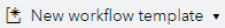
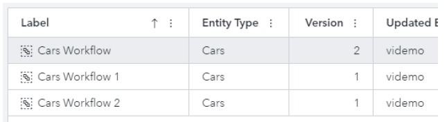
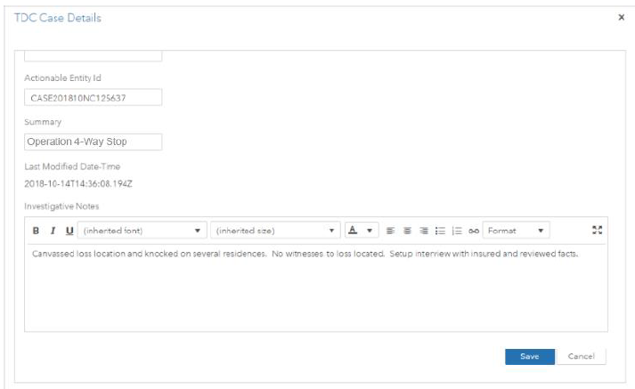

# Creating a Workflow

## Creating one or Multiple Workflows for an Entity

You can create a single workflow for an internal entity that has previously been created or you can create multiple workflows for that entity.

1. Select the **Workflows** tab on the SAS Visual Investigator administration interface and make sure the **Workflow Templates** tab is selected.
2. Click . Select an object from the list. An object is disabled if a workflow has already been created for that object. The New workflow template window appears.
3. In the New workflow template window, the **Label** field contains a default display name for the workflow. You can keep this name or change it. You can also enter a description for the workflow. Click **OK**.
4. In the workflow editor, select an element and drag and drop it into the workflow workspace. The Start element is already provided in the editor. Continue to drag and drop elements until you have the desired workflow.

You can also right-click an element already in the workspace to display an element menu . The displayed menu is based on the element on which you right-click. Click any element on the menu to add it to the workspace.

5. Add properties to your workflow elements.
6. Click  to save the workflow. Workflows must be valid to be saved.

You can also create multiple workflows for a single entity. Follow the preceding instructions to create your first workflow. When you create the second workflow, the steps are the same as creating a single workflow, except the workflow Label must be unique.

Select the same entity from the **New Workflow Template** drop-down list. You will notice that the **Label** field in the New workflow template window has been prepopulated with the name of the first workflow you created, incremented by 1. For example, if you named your first workflow “Cars Workflow” for the “Cars” entity, the next time you create a workflow for the “Cars” entity, the **Label** will be prepopulated with the name “Cars Workflow 1”. Each successive name is incremented by 1 unless you change the name from the default name.

**Note:** The **Label** name must be unique for each entity. However, you can have the same label name for a different entity. For example, two templates can both be named “Tasks” if the templates were associated with different entity types.

## Enabling a Workflow

An Enabled template is a template that is available to be started either through the automatic process of selecting the **Start this workflow when <Entity Name> objects are created** setting on the workflow **Properties** tab, or manually through the **Creating a Start Workflow** menu for the **Tasks** toolbar feature.

To enable a workflow, select the **Workflow Templates** tab. Highlight the workflow that you want to enable. Click  and then select **Enable workflow template**. The value in the Enabled column changes from ‘No’ to ‘Yes’. You can also right-click a workflow and select **Enable workflow template** from the pop-up menu.

A workflow template that is enabled runs when an instance of its entity is created.

## Prompting Users at Task Completion

Users can be prompted for information at the completion of a workflow task. This gives workflows administrators flexibility when designing workflows to match the operational requirements of their consumers. For example, a user might be asked to add comments to a field or to update a field value before completing a task.

When this feature is configured, a dialog box appears when users click a task action. This feature enables users to provide additional information or update existing information before the task is complete.

Here is an example of what a dialog box might look like.

When the user clicks **Save**, that task is completed and any changes that were made to the object are saved. If you set required fields in the page, these fields need to be completed before the task can be completed.

